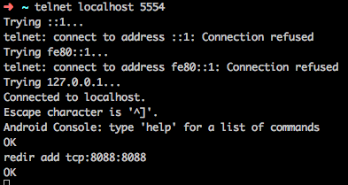
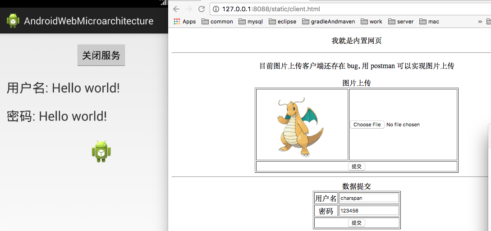
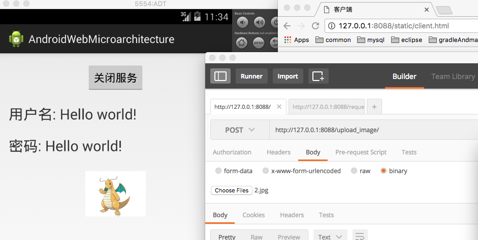
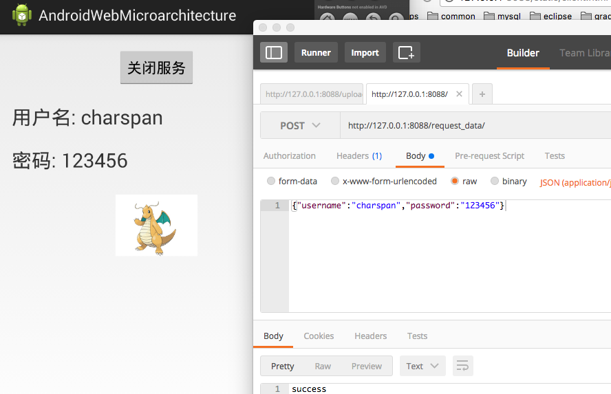

# Android内置WEB服务微架构

### 案例介绍

1. 本案例通过主要android、socket和http开发技术实现了Android内置WEB服务微架构
2. 案例中还包括测试客户端，直接内置为手机的静态网页,目前还有部分 bug 尚未解决,欢迎各位提宝贵意见
3. 用 postman 测试案例所有功能都是有效的

### android 主界面

### 前置步骤

1. 映射 pc 访问路径

2. 启动案例 app, 点击启动服务

### 内置静态网页

访问地址:http://127.0.0.1:8088/static/client.html

### 内置图片上传服务器

上传地址:http://127.0.0.1:8088/upload_image/

### 内置用户注册服务器

上传地址:http://127.0.0.1:8088/request_data/

### 简易测试客户端界面

访问地址:http://127.0.0.1:8088/static/client.html

就是目前还有 bug ...